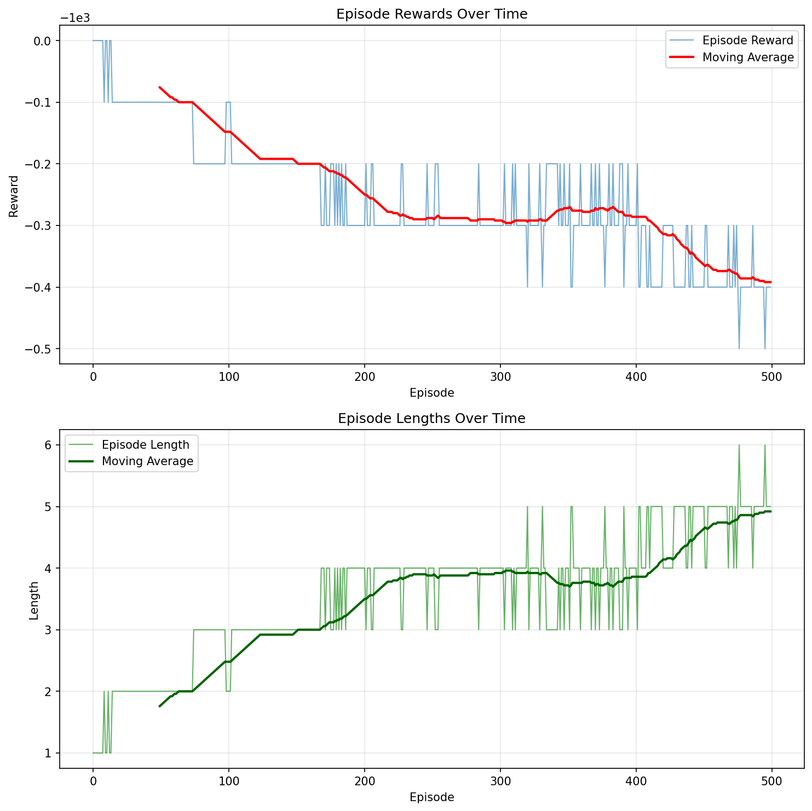
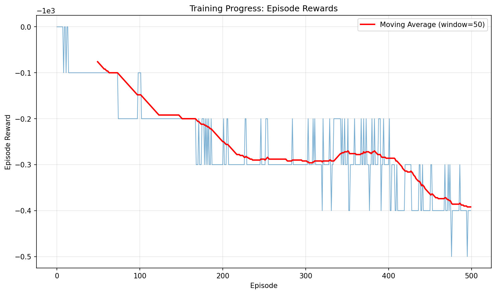
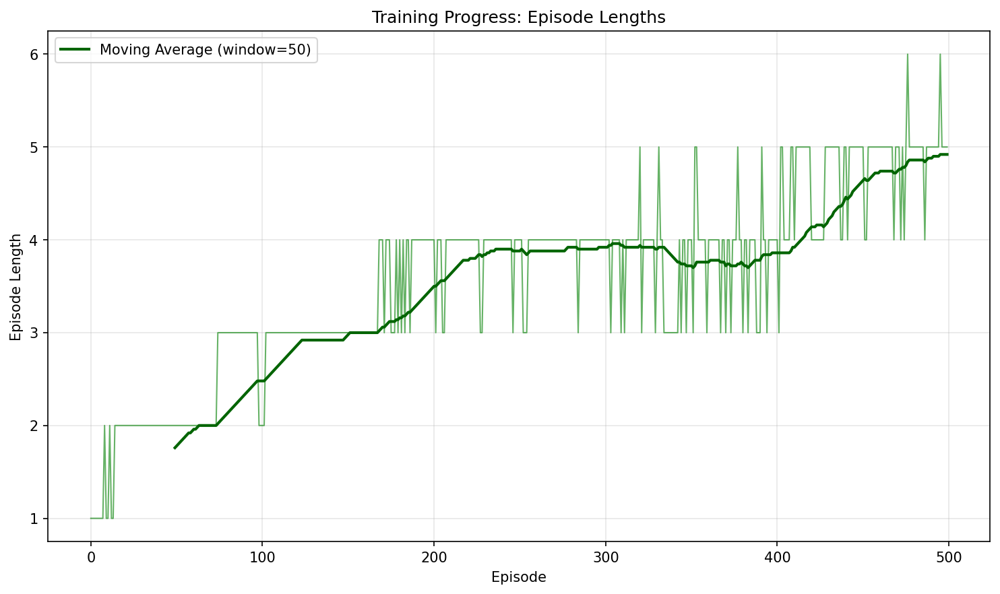

# Tablut Challenge - Python Agent

Hybrid reinforcement learning and minimax agent for the Tablut Challenge. Combines PPO-trained value networks with alpha-beta search for competitive play.

## Architecture

The agent uses a hybrid approach:
- **Minimax search** with alpha-beta pruning and iterative deepening
- **PPO value network** trained through self-play (5M timesteps) for leaf evaluation
- **Heuristics** for move ordering and fallback evaluation
- **TCP socket communication** with Java referee server (JSON protocol)

## Installation

**Prerequisites:** Python 3.10+, Java Runtime (for referee server)

```bash
python3 -m venv venv
source venv/bin/activate
pip install --upgrade pip
pip install -r requirements.txt
```

## Quick Start - Launching the Agent

The easiest way to launch your agent is using the `runmyplayer.sh` script. This script automatically activates the virtual environment and runs the agent with the trained PPO model.

### Prerequisites

**Make sure the Java server is running first!**

In a separate terminal, start the Java server:
```bash
cd Tablut/Executables
java -jar Server.jar
```

Or with GUI (recommended for visualization):
```bash
cd Tablut/Executables
java -jar Server.jar -g
```

### Launch Your Agent

Once the server is running, use the `runmyplayer.sh` script to launch your agent:

```bash
./runmyplayer.sh white 60 127.0.0.1
```

**Command format:**
```bash
./runmyplayer.sh <player> <timeout> <server_ip>
```

**Parameters:**
- `player`: `white` or `black` (case-insensitive)
- `timeout`: Time limit per move in seconds (e.g., `60`)
- `server_ip`: Server IP address (use `127.0.0.1` for localhost)

**Examples:**
```bash
# Play as white player
./runmyplayer.sh white 60 127.0.0.1

# Play as black player
./runmyplayer.sh black 60 127.0.0.1

# With different timeout
./runmyplayer.sh white 120 127.0.0.1
```

**Note:** The script automatically:
- Activates the virtual environment
- Loads the trained PPO model (`models/rl_value_net_5M.zip`)
- Sets search depth to 4
- Connects to the appropriate port (5800 for white, 5801 for black)

## Usage

**Basic (heuristics only):**
```bash
python -m python_client.agent WHITE 60 127.0.0.1
```

**With PPO model:**
```bash
python -m python_client.agent WHITE 60 127.0.0.1 --model models/rl_value_net_5M.zip --depth 4
```

**Parameters:**
- `player`: WHITE or BLACK
- `timeout`: Time limit per move (seconds)
- `server_ip`: Referee server address
- `--model`: Path to PPO model (.zip file)
- `--depth`: Minimax search depth (default: 4)
- `--seed`: Random seed for reproducibility

## Training

PPO training through self-play. The value function is extracted from the trained policy and used for minimax leaf evaluation.

```bash
pip install stable-baselines3

# 5M timesteps (recommended for competition)
python -m python_client.trainer \
    --algo ppo \
    --timesteps 5000000 \
    --save models/rl_value_net_5M.zip \
    --device cpu \
    --checkpoint-interval 250000 \
    --wandb
```

**PPO Configuration:**
- Policy: MlpPolicy (multi-layer perceptron)
- Learning rate: 3e-4, Batch size: 64, Steps: 2048
- Epochs: 10, Gamma: 0.99, GAE lambda: 0.95
- Action masking for legal moves only
- Self-play training with automatic checkpointing

## Training Visualization with Weights & Biases

The project uses [Weights & Biases (wandb)](https://wandb.ai) for tracking and visualizing training metrics in real-time.

### Viewing Training Metrics

**Online Mode (Recommended):**
1. Install and login to wandb:
   ```bash
   pip install wandb
   wandb login
   ```
2. Run training with online mode:
   ```bash
   WANDB_MODE=online python -m python_client.trainer \
       --algo ppo \
       --timesteps 5000000 \
       --save models/rl_value_net_5M.zip \
       --wandb
   ```
3. View dashboard: Visit [https://wandb.ai](https://wandb.ai) and navigate to the `tablut-rl` project

**Offline Mode (Default):**
- Logs are saved locally in `wandb/` directory
- Sync later with: `wandb sync wandb/offline-run-*`

### Tracked Metrics

The following metrics are logged to WandB during training:
- **Episode rewards**: Average and per-episode rewards
- **Episode lengths**: Number of steps per episode
- **Hyperparameters**: Learning rate, batch size, gamma, etc.
- **Training progress**: Timesteps, iterations, checkpoints
- **Model artifacts**: Final and best model checkpoints

#### Generate Static Plots

Use the provided script to generate plots from WandB data:

```bash
# Make sure you're logged in to wandb
wandb login

# Generate plots from latest run
python scripts/generate_wandb_plots.py --project tablut-rl

# Or specify a specific run
python scripts/generate_wandb_plots.py --project tablut-rl --run-id <run_id>
```

This will create plots in `docs/images/` that you can add to the README:

```markdown

```

When training with `--wandb`, you can monitor:
- Real-time training curves (rewards, episode lengths)
- Hyperparameter configurations
- System metrics (CPU, memory usage)
- Model checkpoints and artifacts

For detailed training documentation, see [docs/model-training/TRAINING_GUIDE.md](docs/model-training/TRAINING_GUIDE.md).

## Key Components

- `agent.py`: Main entrypoint, socket communication, game loop
- `minimax_agent.py`: Alpha-beta search with iterative deepening
- `rl_value_wrapper.py`: Extracts value function from PPO policy
- `trainer.py`: PPO self-play training with stable-baselines3
- `tablut_env.py`: Gymnasium environment for RL training
- `heuristics.py`: Move ordering and fallback evaluation


### Training Progress





## Troubleshooting

**Java not found:** Install with `brew install openjdk@17` (macOS) or `sudo apt-get install default-jdk` (Linux)

**Socket connection refused:** Ensure Java server is running on port 5800 (white) or 5801 (black)

**Timeout errors:** Reduce `--depth` parameter

**Import errors:** Activate virtual environment and install dependencies


## Documentation

- [Training Guide](docs/model-training/TRAINING_GUIDE.md): PPO training details
- [Deployment](docs/DEPLOY.md): Competition environment setup
- [API Reference](docs/model-training/API.md): Code examples and interfaces

## Team (The Four Horsemen of Tabluting)

- **Fashad Ahmed Siddique** - [fashad.ahmedsiddique@studio.unibo.it](mailto:fashad.ahmedsiddique@studio.unibo.it) | [GitHub](https://github.com/Fashad-Ahmed)
- **Andrea Pantieri** - [andrea.pantieri@studio.unibo.it](mailto:andrea.pantieri@studio.unibo.it) | [GitHub](https://github.com/Andrea)
- **Giacomo Boschi** - [giacomo.boschi7@studio.unibo.it](mailto:giacomo.boschi7@studio.unibo.it) | [GitHub](https://github.com/GiacomoBoschi2)
- **Massimiliano Bolognini** - [massimilia.bolognini@studio.unibo.it](mailto:massimilia.bolognini@studio.unibo.it) | [GitHub](https://github.com/La-Peticchia)

## References

- [Tablut Competition Repository](https://github.com/AGalassi/TablutCompetition)
- [Ashton Tablut Rules](https://aagenielsen.dk/ashton.php)
